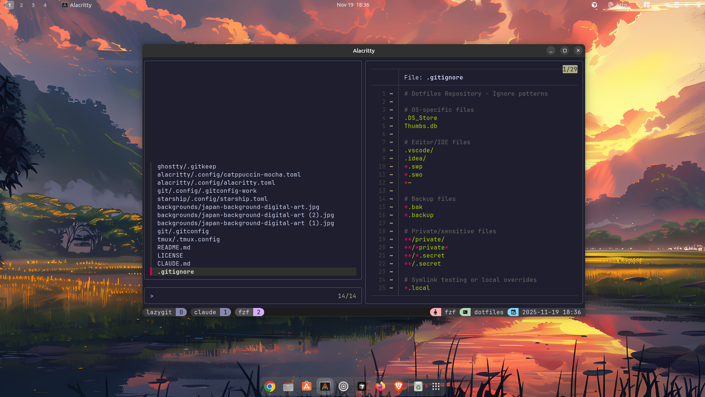

<div align="center">

# dotfiles

*Personal configuration files for a consistent development environment*



</div>

---

## ❖ Information

Welcome to my dotfiles repository! This contains my personal configuration files for various development tools and terminal applications.

**Setup Overview:**
- **OS:** GNU/Linux
- **Terminal:** Alacritty / Ghostty
- **Shell:** (configured via symlinks)
- **Prompt:** Starship
- **Multiplexer:** tmux (with TPM)
- **Theme:** Catppuccin Mocha
- **Version Control:** Git (with conditional identity switching)

---

## ❖ Structure

This repository uses a directory-per-application structure:

```
dotfiles/
├── alacritty/     # Alacritty terminal configuration
├── ghostty/       # Ghostty terminal configuration
├── git/           # Git config with work/personal identity switching
├── starship/      # Starship prompt configuration
├── tmux/          # Tmux configuration with TPM plugins
└── backgrounds/   # Wallpaper images (gitignored)
```

Each application directory contains a `.config/` subdirectory with the actual configuration files, designed to be symlinked to `~/.config/<app-name>/`.

---

## ❖ Installation and Setup

### Prerequisites

- Git
- Your preferred terminal emulator (Alacritty or Ghostty)
- [Starship](https://starship.rs/) prompt
- [Tmux](https://github.com/tmux/tmux) and [TPM](https://github.com/tmux-plugins/tpm)
- A [Nerd Font](https://www.nerdfonts.com/) (configs use JetBrainsMono Nerd Font)

### Clone the Repository

```bash
git clone https://github.com/brinsil/dotfiles.git ~/.dotfiles
cd ~/.dotfiles
```

### Symlinking Configurations

This repository uses **symlink-based deployment**. Link the configurations to their target locations:

<details>
<summary><b>Git Configuration</b></summary>

```bash
ln -sf ~/.dotfiles/git/.gitconfig ~/.gitconfig
ln -sf ~/.dotfiles/git/.config ~/.config/git
```

Make sure to update the email addresses in:
- `git/.gitconfig` (personal email)
- `git/.config/.gitconfig-work` (work email)

The git config will automatically switch identity based on whether you're in `~/Projects/work/**` or elsewhere.

</details>

<details>
<summary><b>Alacritty</b></summary>

```bash
ln -sf ~/.dotfiles/alacritty/.config ~/.config/alacritty
```

Requires JetBrainsMono Nerd Font to be installed.

</details>

<details>
<summary><b>Ghostty</b></summary>

```bash
ln -sf ~/.dotfiles/ghostty/.config ~/.config/ghostty
```

*Note: Ghostty configuration is currently minimal (work in progress).*

</details>

<details>
<summary><b>Starship</b></summary>

```bash
ln -sf ~/.dotfiles/starship/.config/starship.toml ~/.config/starship.toml
```

Make sure starship is installed and initialized in your shell rc file:
```bash
eval "$(starship init bash)"  # or zsh, fish, etc.
```

</details>

<details>
<summary><b>Tmux</b></summary>

```bash
ln -sf ~/.dotfiles/tmux/.tmux.config ~/.tmux.conf
```

Install TPM (Tmux Plugin Manager):
```bash
git clone https://github.com/tmux-plugins/tpm ~/.tmux/plugins/tpm
```

Then install plugins by opening tmux and pressing `prefix + I` (default: `Ctrl+s` then `I`).

</details>

---

## ❖ Theme

All configurations use the **Catppuccin Mocha** color scheme for a consistent aesthetic across all terminal applications:

- Alacritty imports the Catppuccin Mocha theme
- Starship uses the Catppuccin Mocha palette
- Tmux uses the official Catppuccin tmux plugin (v2.1.3)

---

## ❖ Features

### Git Identity Management

The git configuration automatically switches between work and personal identities:
- Default identity (personal) for all repositories
- Work identity automatically applied for projects in `~/Projects/work/**`

This is achieved using git's `includeIf` conditional includes.

### Tmux Plugins

Managed via TPM with the following plugins:
- `tmux-sensible` - Sensible defaults
- `catppuccin/tmux` - Beautiful Catppuccin theme
- `tmux-fzf` - FZF integration for better navigation

### Custom Prefix

Tmux prefix is remapped to `Ctrl+s` (instead of default `Ctrl+b`) for easier access.

---

## ❖ License

This repository is licensed under the MIT License. See [LICENSE](LICENSE) for details.

---

<div align="center">

*Feel free to use these configs as inspiration for your own setup!*

</div>
